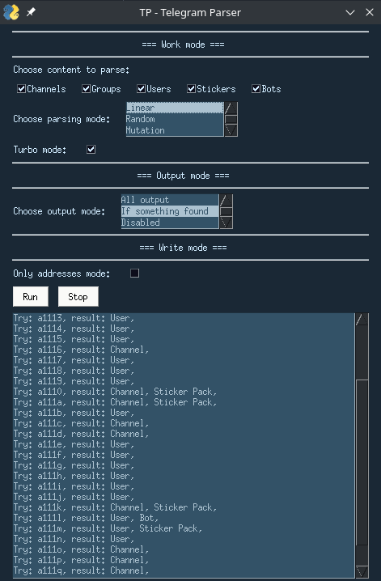

# <p align="center">Парсер Каналов/Групп/Пользователей Telegram
# <p align="center">
Скрипт Telegram Parser анализирует ссылки на Телеграм и сортирует их в раздельные базы данных.


Скрипт не требует аккаунта в Telegram или какого-то использования Telegram API. Весь алгоритм основан на сайте Телеграма и библиотеке BeautifulSoup4, так что он может работать без задержек, вызванных Telegram API.

---

Читайте на [Русском](https://github.com/Antcating/telegram_parser/blob/main/README_ru.md) [English](https://github.com/Antcating/telegram_parser/blob/main/README.md)

### Основные функции

 <br />
*Графический интерфейс для скрипта*
1. GUI!
2. Виды парсинга:
    * Линейный поиск - выбрать длину ссылки и парсить все ссылки, находящиеся в указанном диапазоне.
    * Случайный поиск - создаёт случайные ссылки длинной от 5 до 32 символов и проверяет их.
    * Поиск с мутацией - ввести слово, скрипт создаёт все возможные мутации этого слова и проверяет их.
3. Типы контента для парсинга:
    * Каналы
    * Группы
    * Пользователи
    * Все возможные комбинации указанных выше типов 
4. Турбо-режим - может быть включен чтобы ускорить парсинг. 

---

### Установка и запуск
#### Объединённые исполняемые файлы
Используя терминал:<br />
Чтобы использовать консольную версию программы:
```
git clone https://github.com/Antcating/telegram_parser.git
cd telegram_parser/telegram_parser/
python3 console.py
```
Чтобы использовать графическую версию программы:
```
git clone https://github.com/Antcating/telegram_parser.git
cd telegram_parser/telegram_parser/
python3 gui.py
```

#### Разделенные исполняемые файлы
Using console:<br />
Чтобы использовать консольную версию программы:
```
git clone https://github.com/Antcating/telegram_parser.git
cd telegram_parser/telegram_parser_console/
python3 main.py
```
Чтобы использовать графическую версию программы:
```
git clone https://github.com/Antcating/telegram_parser.git
cd telegram_parser/telegram_parser_gui/
python3 gui.py
```
#### Внимание!
Убедитесь, что у вас установлены все зависимости:
```
cd telegram_parser
pip3 install -r requirements.txt
```
Если вы уже загружали старую версию программы в прошлом, вы можете удалить и пройти все установочные инструкции или просто обновить существующую версию программы:
```
cd telegram_parser
git pull
```
---

### Настройка

#### Изначальная настройка
Полная конфигурация, в которую входят:
* Тип парсинга
* Турбо-режим
* Тип контента для парсинга
* Дополнительные опции для некоторых типов
* и тд, <br />
задаётся в начале скрипта.

---

### Использование
Из директории, в которую вы сказали скрипт, перейдите в поддиректорию  _telegram_parser_, и запустите команду _python3 gui.py_ или _python3 console.py_

---

### Зависимости и благодарности
* [Beautiful Soup 4](https://www.crummy.com/software/BeautifulSoup/)
* [Requests](https://docs.python-requests.org/en/master/)
* [PySimpleGUI](https://github.com/PySimpleGUI/PySimpleGUI) <br />
Отдельная благодарность [@flexagoon](https://t.me/flexagoon) за перевод README.md на русский язык.
